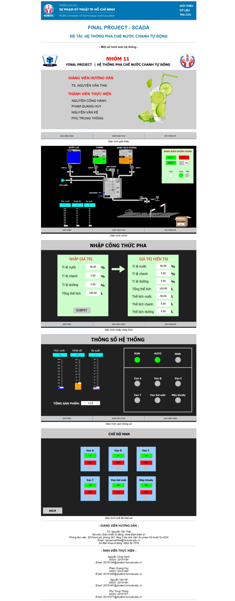
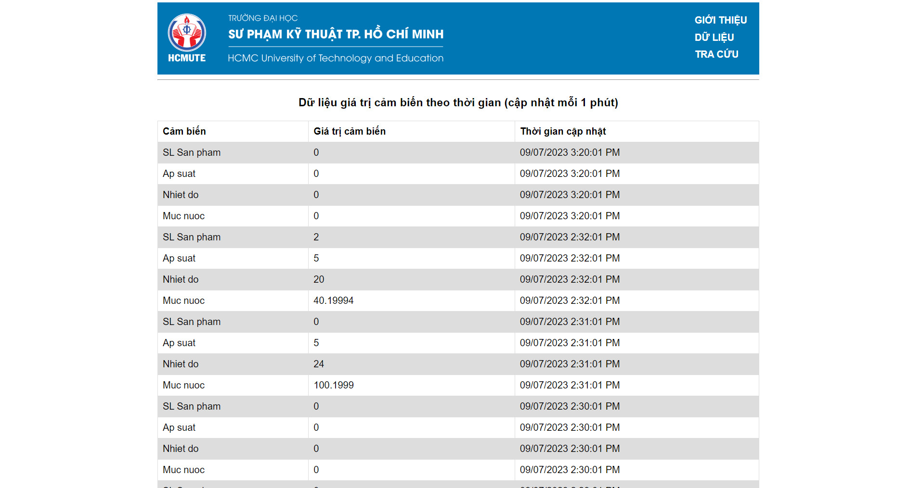
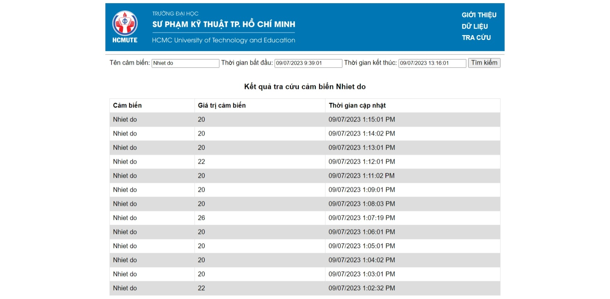

 <h1 align="center">Website của hệ thống SCADA</h1>

Website hiển thị và cho phép tra cứu giá trị của các cảm biến trong hệ thống SCADA. Về phần dữ liệu, các dữ liệu sẽ được cập nhật mỗi 1 phút từ PLC để lưu vào Database, sau đó sẽ cập nhật hiển thị lên Web

   
  <i>Trang giới thiệu của Web</i>

   
  <i>Trang hiển thị dữ liệu</i>

   
  <i>Trang tra cứu giá trị cảm biến</i>

